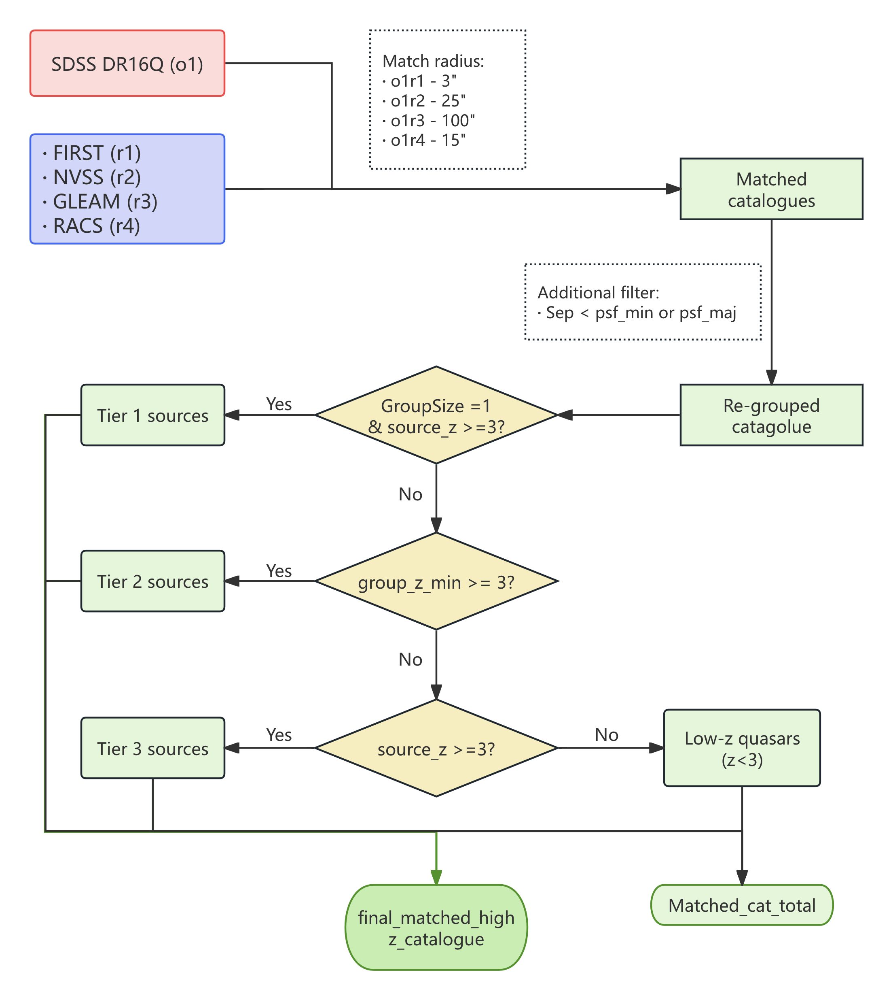

# High-z_catalogue
## Author info
- Author: 	Yingkang Zhang
- E-Mail: 	ykzhang@shao.ac.cn
- Institution1:	SHAO - Shanghai Astronomical Observatory, CAS, China
- Institution2: CSIRO, Australia


## Basic info
We generate this catalogue that contains the most comprehensive cross-matching and analysis of radio quasars at redshifts > 3.

Update time: 2025-06-01

Just some bash and STILTS scripts (a little bit python) on a comprehensive cross-matching to look for high-z radio quasars.
The STILTS scripts are used to do the cross-matching (see image for preview and script codes in `/scripts` for details).

Catalogues used (see /catalogues for details): 
- SDSS dr16q (2020ApJS..250....8L)
- NVSS (1998AJ....115.1693C)
- FIRST (2015ApJ...801...26H)
- GLEAM (2017MNRAS.464.1146H)
- RACS (2021PASA...38...58H)


## Usage
- First, download this repo to your device and untar.
- Download the catalogues above (via TOPCAT or other sources of database, save as `.fits` format) and place them in the `/catalogues`
- Rename the fits files to make the input names meet, or you can edit it to used different input names in the `/scripts/scritp1_assigning` file (part 2): 
  ```
  SDSSdr16q="${CAT_DIR}/DR16Q_v4.fits"
  FIRSTcat="${CAT_DIR}/first14.fits"
  NVSScat="${CAT_DIR}/nvss.fits"
  GLEAMcat="${CAT_DIR}/gleam_full.fits"
  RACScat="${CAT_DIR}/racs1.fits"
  ```
- then run `run_scripts.sh` by navigating to `/scripts` and :
  ```
  ./run_scripts
  ```
- run `make_cat.py` in the base directory to generate the `csv` table:
  ```
  python make_cat.py
  ```

- the output will include the following catalogues:
  1. The run_scripts.log stores the logs that generagted during the , just check it after the run to see if there are erros. If no errors for the processing then you should get the fllowing outputs.
  2. The final catalogue `final_matched_highz_catalogue` in `.csv` format, in the basic directory. And the `.fits` catalogue in the `/scripts` directory.
  3. Catalogues that can be used to check results:
    - The `sdss_z_over3.csv` in base dir that showing all optical quasars with redshift > 3.
    - The `matched_o1r1234_total_highz.fits` in the `/scripts` directory which keeps most columns during the matching for you to check.
    - If you want to further check the process, you can comment out line 24 (the `rm *` line) in the `run_scripts` then you can find every temp files during the matching.


Please contact the author if you have any questions.


## Acknowledgement
  [1] This work is supported by the Shanghai Sailing Program under grant number 22YF1456100

  [2] TA thanks Fabio Luchsinger from CSIRO for their STILTS tutorial talk, which inspired the cross-matching methodology used in this work.
